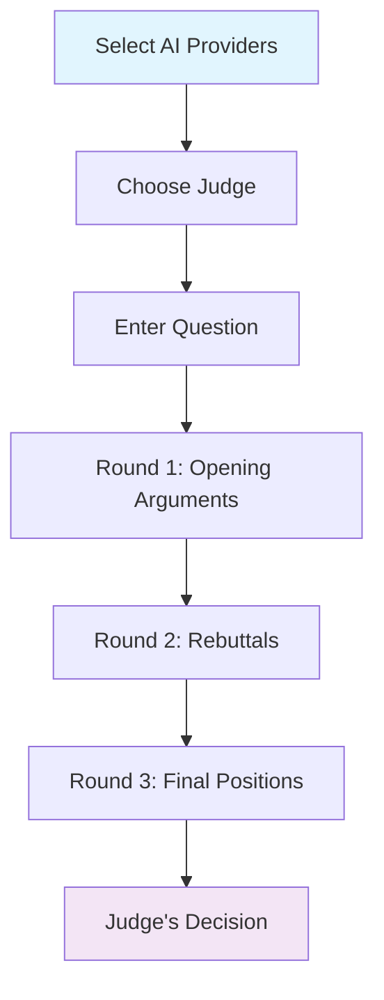

# 🍑 ASS - Argumentative System Service

<div align="center">

[](https://www.python.org/downloads/)
[](https://docs.astral.sh/uv/)
[](https://rich.readthedocs.io/)

*Where AI personalities get into heated arguments about everything*

</div>

## 🎭 What is ASS?

**ASS (Argumentative System Service)** is a command-line application that orchestrates structured debates between AI personalities from different providers. Each personality has unique traits, perspectives, and argumentation styles, creating dynamic and insightful discussions on any topic you propose.

> **🤖 AI-Generated Project**: This entire project was generated by AI from an original idea by [Diogo](https://github.com/DiogoNeves). The concept, architecture, code, and documentation were all created through an AI-assisted development process, demonstrating the potential of human-AI collaboration in software creation.


**Perfect for:**
- 🧠 **Exploring complex topics** from multiple perspectives
- 📚 **Educational discussions** and critical thinking exercises  
- 🤔 **Decision-making** by weighing different viewpoints
- 🎪 **Entertainment** - watch AIs argue about anything!
- 🔬 **Research** into AI personality modeling and multi-agent systems

## 🎭 Meet the Debaters

| Personality | Provider | Traits | Perspective |
|-------------|----------|--------|-------------|
| **🌟 Claude Optimist** | Claude | Creative, big-picture, opportunity-focused | Sees possibilities everywhere |
| **🔍 Claude Skeptic** | Claude | Analytical, detail-oriented, risk-aware | Points out flaws and limitations |
| **🚀 GPT Visionary** | OpenAI | Forward-thinking, innovative, solution-oriented | Champions breakthrough ideas |
| **⚖️ GPT Critic** | OpenAI | Methodical, cautious, problem-focused | Highlights potential issues |
| **💡 Gemini Visionary** | Google | Innovative, transformative, trend-focused | Champions bold ideas with practical backing |
| **🔬 Gemini Analyst** | Google | Systematic, critical, detail-focused | Evaluates long-term implications |
| **🤝 Gemini Mediator** | Google | Balanced, thoughtful, bridge-building | Finds common ground between views |

- After three rounds of heated debate, an **impartial Judge** synthesizes all arguments into a balanced final decision.

## 🎬 Example Debates

### 🤖 "Should we develop AGI as fast as possible?"

<details>
<summary>Click to see the debate highlights</summary>

**Claude Optimist:** *"The potential benefits are extraordinary! AGI could solve climate change, cure diseases, and unlock technologies we can't even imagine. The faster we develop it responsibly, the sooner we can address humanity's greatest challenges!"*

**GPT Critic:** *"This rush toward AGI poses existential risks we don't fully understand. Without proper safety frameworks and international oversight, we could create systems that operate beyond human control or comprehension."*

**GPT Visionary:** *"What if we're thinking too small? AGI represents the next evolutionary leap for intelligence itself. With proper safeguards, we could create benevolent systems that enhance human potential rather than replace it."*

**Claude Skeptic:** *"The alignment problem remains unsolved. How can we ensure AGI systems will pursue human values when we haven't even agreed on what those values are? The technical challenges of safe AGI are being dangerously underestimated."*

**Judge's Decision:** *"A measured approach prioritizing safety research alongside capability development, with mandatory international cooperation frameworks..."*

</details>

### 🍕 "Is pineapple on pizza acceptable?"

<details>
<summary>Click to see this heated culinary debate</summary>

**Claude Optimist:** *"Pineapple on pizza represents culinary creativity at its finest! The sweet-savory combination creates delightful flavor contrasts, and food should be about joy and experimentation, not rigid rules!"*

**GPT Critic:** *"This combination violates fundamental principles of Italian cuisine. The high water content of pineapple creates soggy crusts, while the sweetness overwhelms the carefully balanced acidity of traditional tomato sauce."*

**GPT Visionary:** *"Hawaiian pizza opened the door to global fusion cuisine! Without this bold experiment, we might never have discovered other amazing combinations like BBQ chicken or breakfast pizzas."*

**Claude Skeptic:** *"Traditional pizza recipes evolved over centuries for good reasons. Adding random fruits doesn't constitute innovation—it's culinary chaos that diminishes the integrity of a perfect food."*

**Judge's Decision:** *"While respecting traditional Italian cuisine, food evolution through cultural fusion has created legitimate new traditions. Pineapple pizza, though controversial, represents valid culinary diversity..."*

</details>

## 🚀 Quick Start

### Prerequisites
- **Python 3.9+**
- **UV package manager** ([install here](https://docs.astral.sh/uv/getting-started/installation/))
- **API Keys** (Only needed for the providers you choose):
  - OpenAI API key (for GPT personalities) - [Get here](https://platform.openai.com/api-keys)
  - Anthropic Claude API key (for Claude personalities) - [Get here](https://console.anthropic.com/)
  - Google Gemini API key (for Gemini personalities) - [Get here](https://aistudio.google.com/apikey)

### Installation

1. **Clone the repository:**
   ```bash
   git clone https://github.com/DiogoNeves/ass.git
   cd ass
   ```

2. **Install dependencies:**
   ```bash
   uv sync
   ```

3. **Set up your API keys:**
   You have two options:

   a) Create a `.env` file:
   ```env
   CLAUDE_API_KEY=your_claude_api_key_here    # For Claude personalities
   OPENAI_API_KEY=your_openai_api_key_here    # For GPT personalities
   GEMINI_API_KEY=your_gemini_api_key_here    # For Gemini personalities
   ```

   b) Enter keys when prompted:
   - If you run without a `.env` file, the app will interactively ask for the API keys you need
   - Keys are validated immediately to ensure they work
   - You'll get clear error messages if there are any issues
   - Keys are stored only for the current session

### Running Debates

**Interactive Mode** - Ask any question:
```bash
uv run python debate_app.py
```

You'll be guided through:
1. Choosing which AI providers to use (Claude, OpenAI, Gemini, or combinations)
2. Entering/validating any required API keys
3. Selecting a judge (Claude or Gemini)
4. Entering your debate question

**Demo Mode** - See a pre-configured debate:
```bash
uv run python demo.py
```

## 🎮 How It Works



1. **🎯 Provider Selection** - Choose which AI providers to include
2. **⚖️ Judge Selection** - Pick Claude or Gemini as judge
3. **❓ Question Input** - Provide any topic for debate
4. **🗣️ Three Debate Rounds** - Selected personalities argue their positions
5. **📝 Context Building** - Each round builds on previous arguments
6. **🎯 Final Judgment** - Chosen judge synthesizes all viewpoints

## 🛠️ Architecture

The application uses a modular **Personality System** that makes it easy to create new AI debaters:

```python
# Create a new personality
new_personality = create_personality(PersonalityConfig(
    name="My Custom Debater",
    model_provider="claude",  # or "openai" or "gemini"
    model_name="claude-sonnet-4-20250514",
    system_prompt="Your personality description...",
    traits={"creativity": 8, "skepticism": 6, "humor": 9}
))
```

**Key Components:**
- `PersonalityConfig` - Define model, prompts, and personality traits
- `LLMPersonality` - Abstract base class for all personalities  
- `create_personality()` - Factory function for easy personality creation
- Rich CLI interface with beautiful formatting and animations

### Supported Models

**Anthropic Claude:**
- `claude-sonnet-4-20250514` (Latest & Recommended - 2025)
- `claude-3-5-sonnet-20241022` 
- `claude-3-haiku-20240307`

**OpenAI:**
- `gpt-4.1-2025-04-14` (Latest & Recommended - 2025)
- `gpt-4`
- `gpt-4-turbo`
- `gpt-3.5-turbo`

**Google Gemini:**
- `gemini-2.5-pro-preview-05-06` (Latest & Recommended - 2025)
- `gemini-2.5-pro`
- `gemini-2.5-flash-preview-04-17`
- `gemini-2.5-flash`
- `gemini-2.0-flash`

## 📁 Project Structure

```
ass/
├── 📄 README.md           # This file
├── ⚙️ pyproject.toml      # UV project configuration  
├── 🔒 uv.lock            # Dependency lock file
├── 🔐 .env               # API keys (create this)
├── 📁 .venv/             # Virtual environment (auto-created)
├── 🧠 personality.py      # Personality system and API integrations
├── 🎭 debate_app.py       # Main interactive application
└── 🎬 demo.py            # Demo runner with sample debate
```

## 💡 Interesting Questions to Try

### 🧠 **Philosophy & Ethics**
- "Is free will an illusion?"
- "Should we prioritize individual freedom or collective security?"
- "Is artificial consciousness possible?"

### 🌍 **Society & Technology**  
- "Should social media be regulated like tobacco?"
- "Is remote work better for society than office work?"
- "Should we colonize Mars or fix Earth first?"

### 🎨 **Creative & Fun**
- "Which is the superior breakfast: cereal or toast?"
- "Should we bring back extinct species through genetic engineering?"
- "Is a hot dog a sandwich?"

### 🏛️ **Policy & Governance**
- "Should voting be mandatory in democracies?"
- "Is universal basic income feasible?"
- "Should we abolish daylight saving time?"

## 🎨 Features

- **🎭 Rich CLI Interface** - Colored panels, animations, and beautiful formatting
- **🔄 Turn-based Debates** - Structured rounds with context accumulation
- **🤖 Multi-Model Support** - Leverages Claude, OpenAI, and Gemini APIs
- **🔧 Extensible Design** - Easy to add new personalities and traits
- **⚡ Real-time Feedback** - Progress indicators and thinking animations
- **📝 Context Awareness** - Each debater builds on previous arguments

## 🔧 Customization

### Adding New Personalities

Extend the debate by creating personalities with unique traits:

```python
personalities["economist"] = create_personality(PersonalityConfig(
    name="Dr. Economy",
    model_provider="openai",
    model_name="gpt-4.1-2025-04-14",
    system_prompt="You are a pragmatic economist focused on costs, benefits, and market dynamics...",
    traits={"analytical": 9, "pragmatic": 8, "data_focused": 10}
))
```

## 🤝 Contributing

We welcome contributions! Here are some ideas:

- **🎭 New Personality Types** - Add specialists (scientist, artist, philosopher)
- **🔌 Additional LLM Providers** - Support for more AI models
- **🎪 Enhanced Debate Formats** - Tournament brackets, team debates
- **🎨 UI Improvements** - Better visualizations and formatting
- **📊 Analytics** - Argument analysis and debate statistics

### Development Setup

```bash
# Clone and setup
git clone https://github.com/DiogoNeves/ass.git
cd ass
uv sync

# Run tests (if you add them)
uv run pytest

# Format code
uv run black .
```

## 🛠️ Troubleshooting

**🔑 API Key Issues:**
- Ensure your `.env` file is in the project root
- Verify API keys are valid and have sufficient credits
- Check that keys don't have extra spaces or quotes

**📦 Import Errors:**
- Run `uv sync` to install all dependencies
- Ensure you're using Python 3.9+
- Use `uv run python script.py` instead of `python script.py`

**🌐 UV Issues:**
- Install UV: [Installation Guide](https://docs.astral.sh/uv/getting-started/installation/)
- Update UV: `uv self update`

## 📜 License

MIT License - see [LICENSE](LICENSE) file for details.

## 🙏 Acknowledgments

- **[Rich](https://rich.readthedocs.io/)** - Beautiful terminal formatting
- **[OpenAI](https://openai.com/)** - GPT models and API
- **[Anthropic](https://anthropic.com/)** - Claude models and API
- **[Google](https://aistudio.google.com/)** - Gemini models and API
- **[UV](https://docs.astral.sh/uv/)** - Fast Python package manager

---

<div align="center">

**🎭 Ready to watch AIs debate? Start a discussion and see what happens! 🎭**

[⭐ Star this repo](https://github.com/DiogoNeves/ass) • [🐛 Report Bug](https://github.com/DiogoNeves/ass/issues) • [💡 Request Feature](https://github.com/DiogoNeves/ass/issues)

</div>
