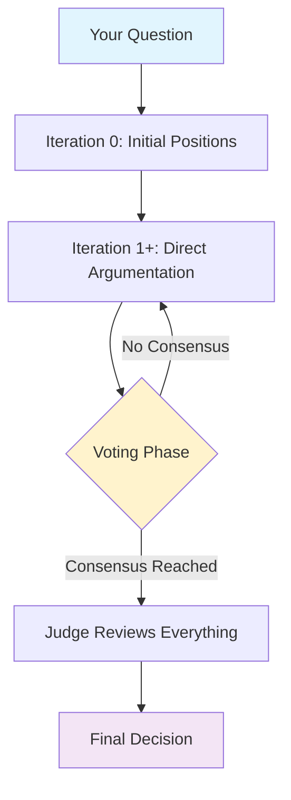
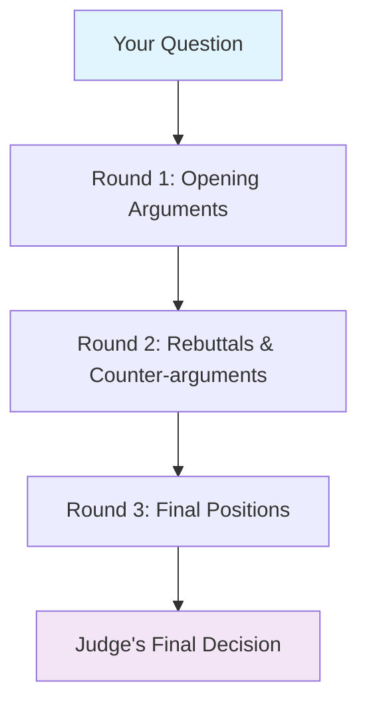

# 🍑 ASS - Argumentative System Service

<div align="center">

[](https://www.python.org/downloads/)
[](https://docs.astral.sh/uv/)
[](https://rich.readthedocs.io/)

*A sophisticated debate system for reaching better answers through AI argumentation*

</div>

## 🎭 What is ASS?

**ASS (Argumentative System Service)** is an advanced debate simulation platform that models how expert-level AI personalities argue, reason, and potentially change their minds when presented with compelling evidence. Using internal belief states and sophisticated reasoning systems, ASS helps explore complex topics from multiple perspectives to arrive at more nuanced, well-considered conclusions.

> **🤖 AI-Generated Project**: This entire project was generated by AI from an original idea by [Diogo](https://github.com/DiogoNeves). The concept, architecture, code, and documentation were all created through an AI-assisted development process, demonstrating the potential of human-AI collaboration in software creation.

**Perfect for:**
- 🧠 **Complex Problem-Solving** - Model expert debates to find optimal solutions
- 🔬 **Research & Analysis** - Explore topics with rigorous, evidence-based reasoning
- 🤔 **Decision Support** - Get high-quality arguments from multiple expert perspectives
- 📚 **Educational Tools** - Demonstrate critical thinking and belief revision
- 🎯 **Truth-Seeking** - Watch AI experts converge on well-reasoned conclusions

## 🎭 Meet the Debaters

| Personality | Provider | Traits | Perspective |
|-------------|----------|--------|-------------|
| **🌟 Claude Optimist** | Claude | Creative, big-picture, opportunity-focused | Sees possibilities everywhere |
| **🔍 Claude Skeptic** | Claude | Analytical, detail-oriented, risk-aware | Points out flaws and limitations |
| **🚀 GPT Visionary** | OpenAI | Forward-thinking, innovative, solution-oriented | Champions breakthrough ideas |
| **⚖️ GPT Critic** | OpenAI | Methodical, cautious, problem-focused | Highlights potential issues |

Each personality maintains internal beliefs about truth while presenting arguments, potentially updating their views when faced with compelling evidence. After reaching consensus through voting, an **impartial Judge** synthesizes all perspectives into a final decision.

## 🧠 Revolutionary Features

### Internal Belief Systems
Each AI personality maintains private beliefs about what's actually true, separate from their public arguments. They can:
- Form expert-level initial assessments based on evidence
- Update beliefs when presented with compelling counter-arguments
- Maintain intellectual honesty while arguing their position

### Dynamic Consensus Building
- Personalities debate until reaching agreement through ranked voting
- Arguments must directly engage with others' points
- Real belief revision when evidence warrants it
- Configurable resistance to changing minds

### Expert-Level Reasoning
- Deep analysis with citations and evidence
- Field-specific expertise applied to questions
- Rigorous logical argumentation
- Truth-seeking balanced with debate dynamics

## 🎬 Example Debates

### 🤖 "Should we develop AGI as fast as possible?"

<details>
<summary>Click to see the debate highlights</summary>

**Claude Optimist:** *"The potential benefits are extraordinary! AGI could solve climate change, cure diseases, and unlock technologies we can't even imagine. The faster we develop it responsibly, the sooner we can address humanity's greatest challenges!"*

**GPT Critic:** *"This rush toward AGI poses existential risks we don't fully understand. Without proper safety frameworks and international oversight, we could create systems that operate beyond human control or comprehension."*

**GPT Visionary:** *"What if we're thinking too small? AGI represents the next evolutionary leap for intelligence itself. With proper safeguards, we could create benevolent systems that enhance human potential rather than replace it."*

**Claude Skeptic:** *"The alignment problem remains unsolved. How can we ensure AGI systems will pursue human values when we haven't even agreed on what those values are? The technical challenges of safe AGI are being dangerously underestimated."*

**Judge's Decision:** *"A measured approach prioritizing safety research alongside capability development, with mandatory international cooperation frameworks..."*

</details>

### 🍕 "Is pineapple on pizza acceptable?"

<details>
<summary>Click to see this heated culinary debate</summary>

**Claude Optimist:** *"Pineapple on pizza represents culinary creativity at its finest! The sweet-savory combination creates delightful flavor contrasts, and food should be about joy and experimentation, not rigid rules!"*

**GPT Critic:** *"This combination violates fundamental principles of Italian cuisine. The high water content of pineapple creates soggy crusts, while the sweetness overwhelms the carefully balanced acidity of traditional tomato sauce."*

**GPT Visionary:** *"Hawaiian pizza opened the door to global fusion cuisine! Without this bold experiment, we might never have discovered other amazing combinations like BBQ chicken or breakfast pizzas."*

**Claude Skeptic:** *"Traditional pizza recipes evolved over centuries for good reasons. Adding random fruits doesn't constitute innovation—it's culinary chaos that diminishes the integrity of a perfect food."*

**Judge's Decision:** *"While respecting traditional Italian cuisine, food evolution through cultural fusion has created legitimate new traditions. Pineapple pizza, though controversial, represents valid culinary diversity..."*

</details>

## 🚀 Quick Start

### Prerequisites
- **Python 3.9+**
- **UV package manager** ([install here](https://docs.astral.sh/uv/getting-started/installation/))
- **API Keys:**
  - OpenAI API key
  - Anthropic Claude API key

### Installation

1. **Clone the repository:**
   ```bash
   git clone https://github.com/DiogoNeves/ass.git
   cd ass
   ```

2. **Install dependencies:**
   ```bash
   uv sync
   ```

3. **Set up your API keys:**
   Create a `.env` file:
   ```env
   CLAUDE_API_KEY=your_claude_api_key_here
   OPENAI_API_KEY=your_openai_api_key_here
   ```

### Running Debates

**Interactive Mode** - Ask any question:
```bash
uv run python debate_app.py
```

**Demo Mode** - See a pre-configured debate:
```bash
uv run python demo.py
```

## 🎮 How It Works

### 🗳️ Voting Mode (Default)



1. **🎯 Question Input** - You provide any question or topic
2. **💭 Initial Positions** - Each personality presents their stance without arguing
3. **🥊 Argumentation** - Personalities directly engage with each other's points
4. **🗳️ Voting** - After each iteration, personalities rank all participants
5. **🔄 Consensus Check** - Continue until voting threshold is reached
6. **⚖️ Judge Review** - Final synthesis with potential override

### 🎭 Classic Mode



Use `--classic-mode` to run the original 3-round format.

## 🛠️ Architecture

The application uses a modular architecture with **Pydantic validation** and clear separation of concerns:

```python
# Create a new personality with validated configuration
from models.personality import PersonalityConfig
from personalities import create_personality

new_personality = create_personality(PersonalityConfig(
    name="My Custom Debater",
    model_provider="claude",  # or "openai" or "local"
    model_name="claude-3-5-sonnet-20241112",
    system_prompt="Your personality description...",
    reasoning_depth=8,
    truth_seeking=7,
    voting_traits=PersonalityTraits(fairness=8, self_confidence=6)
))
```

**Key Components:**
- **`models/`** - Pydantic models with automatic validation:
  - `PersonalityConfig` - Validated personality configuration
  - `Vote`, `VotingConfig` - Voting system models
  - `DebateConfig`, `DebateState` - Debate management
  - `Argument`, `ArgumentHistory` - Argument tracking
- **`personalities/`** - AI personality implementations:
  - `LLMPersonality` - Abstract base class
  - `ClaudePersonality`, `OpenAIPersonality`, `LocalModelPersonality`
- **`services/`** - Business logic:
  - `DebateManager` - Core debate orchestration
  - `FileManager` - Save/load debates with AI titles
- **`ui/`** - User interface:
  - `RichFormatter` - Terminal formatting
  - `PromptHandler` - User input handling

## 💡 Interesting Questions to Try

### 🧠 **Philosophy & Ethics**
- "Is free will an illusion?"
- "Should we prioritize individual freedom or collective security?"
- "Is artificial consciousness possible?"

### 🌍 **Society & Technology**  
- "Should social media be regulated like tobacco?"
- "Is remote work better for society than office work?"
- "Should we colonize Mars or fix Earth first?"

### 🎨 **Creative & Fun**
- "Which is the superior breakfast: cereal or toast?"
- "Should we bring back extinct species through genetic engineering?"
- "Is a hot dog a sandwich?"

### 🏛️ **Policy & Governance**
- "Should voting be mandatory in democracies?"
- "Is universal basic income feasible?"
- "Should we abolish daylight saving time?"

## 🎨 Features

- **🧠 Internal Belief States** - AI personalities maintain private beliefs about truth
- **🎓 Expert-Level Reasoning** - Deep analysis with evidence and field-specific knowledge
- **🔄 Belief Revision** - Personalities can genuinely change their minds with strong evidence
- **🗳️ Consensus-Based Voting** - Debate until reaching agreement through ranked voting
- **💬 Direct Argumentation** - Must engage with others' specific points
- **📊 Configurable Persistence** - Control how resistant each personality is to changing beliefs
- **🤖 Multi-Model Support** - Claude, OpenAI, and local model servers
- **⚖️ Truth-Seeking Judge** - Maximum reasoning depth and openness to best arguments
- **🎯 Sophisticated Traits** - Belief persistence, reasoning depth, truth-seeking levels
- **✅ Pydantic Validation** - Runtime validation of all data structures with clear error messages
- **🔧 Highly Configurable** - JSON configs, environment variables, CLI flags
- **📈 Belief Tracking** - Monitor how positions evolve through debate
- **🎭 Rich CLI Interface** - Beautiful formatting with progress indicators
- **💾 Automatic Debate Saving** - Preserves complete debate history with AI-generated titles
- **🏗️ Modular Architecture** - Clear separation between models, services, UI, and personalities

## 🔧 Customization

### Adding New Personalities

Extend the debate by creating personalities with unique traits (with full validation):

```python
from models.personality import PersonalityConfig, PersonalityTraits

personalities["economist"] = create_personality(PersonalityConfig(
    name="Dr. Economy", 
    model_provider="openai",
    model_name="gpt-4o-20250117",
    system_prompt="You are a pragmatic economist focused on costs, benefits, and market dynamics...",
    reasoning_depth=9,
    truth_seeking=8,
    belief_persistence=7,
    voting_traits=PersonalityTraits(
        fairness=8,
        self_confidence=7,
        strategic_thinking=9,
        empathy=6
    )
))
```

### Supported Models

**Anthropic Claude:**
- `claude-sonnet-4-20250514` (Latest & Recommended - 2025)
- `claude-3-5-sonnet-20241022` 
- `claude-3-haiku-20240307`
- Other Claude models

**OpenAI:**
- `gpt-4.1-2025-04-14` (Latest & Recommended - 2025)
- `gpt-4`
- `gpt-4-turbo`
- `gpt-3.5-turbo`

**Local Models:**
- Any OpenAI-compatible API endpoint
- Configure with `--local-model-url` or `LOCAL_MODEL_URL` environment variable

### Configuration Options

#### Command Line Arguments

```bash
# Voting mode options
uv run python debate_app.py --voting-threshold 0.8  # Set consensus to 80%
uv run python debate_app.py --max-iterations 15     # Allow up to 15 rounds
uv run python debate_app.py --min-iterations 3      # Require 3 rounds before voting

# Classic mode
uv run python debate_app.py --classic-mode           # Use original 3-round format
uv run python debate_app.py --no-voting             # Disable voting system

# Local model support
uv run python debate_app.py --local-model-url http://localhost:8080

# Configuration file
uv run python debate_app.py --config my_config.json

# Disable automatic saving
uv run python debate_app.py --no-save
```

#### Environment Variables

```bash
# Voting configuration
export DEBATE_VOTING_ENABLED=true
export DEBATE_CONSENSUS_THRESHOLD=0.75
export DEBATE_MAX_ITERATIONS=10
export DEBATE_CLASSIC_MODE=false

# Local model configuration
export LOCAL_MODEL_URL=http://localhost:8080
export LOCAL_MODEL_AUTH=your-auth-token
export LOCAL_MODEL_TIMEOUT=30

# API Keys (existing)
export CLAUDE_API_KEY=your_claude_key
export OPENAI_API_KEY=your_openai_key
```

#### Configuration File

Create a JSON configuration file (see `sample_config.json`):

```json
{
  "voting_enabled": true,
  "consensus_threshold": 0.75,
  "min_iterations": 2,
  "max_iterations": 10,
  "scoring_system": {
    "1": 4,
    "2": 3,
    "3": 2,
    "4": 1
  },
  "judge_can_override": true,
  "override_threshold": 0.9,
  "allow_local_models": true,
  "local_model_timeout": 30,
  "classic_mode": false
}
```

## 📁 Project Structure

```
ass/
├── 📄 README.md           # This file
├── ⚙️ pyproject.toml      # UV project configuration (includes Pydantic)
├── 🔒 uv.lock            # Dependency lock file
├── 🔐 .env               # API keys (create this)
├── 📁 models/            # Pydantic data models with validation
│   ├── __init__.py
│   ├── personality.py    # PersonalityConfig, PersonalityTraits
│   ├── voting.py         # Vote, VotingConfig, VotingResult
│   ├── debate.py         # DebateConfig, DebateState
│   └── arguments.py      # Argument, ArgumentHistory
├── 📁 personalities/     # AI personality implementations
│   ├── __init__.py
│   ├── base.py          # LLMPersonality abstract base class
│   ├── claude.py        # Claude implementation
│   ├── openai.py        # OpenAI implementation
│   ├── local.py         # Local model implementation
│   └── factory.py       # create_personality factory
├── 📁 services/         # Business logic services
│   ├── __init__.py
│   ├── debate_manager.py # Core debate orchestration
│   └── file_manager.py   # Save/load with AI titles
├── 📁 ui/               # User interface components
│   ├── __init__.py
│   ├── rich_formatter.py # Rich terminal formatting
│   └── prompts.py       # User input handling
├── 🧠 personality.py     # Backward compatibility imports
├── 🗳️ voting.py         # Voting system implementation
├── ⚙️ config.py         # Legacy configuration (use models/debate.py)
├── 🎭 debate_app.py      # Main interactive application
├── 🎬 demo.py           # Demo runner with sample debates
├── 📋 sample_config.json # Example configuration file
├── 📄 VOTING-FEATURE.md  # Voting feature requirements
└── 📁 debates/          # Saved debate files (auto-created)
    └── .gitkeep         # Keeps folder in git
```

## 🤝 Contributing

We welcome contributions! Here are some ideas:

- **🎭 New Personality Types** - Add specialists (scientist, artist, philosopher)
- **🔌 Additional LLM Providers** - Support for more AI models (Gemini, Mistral, etc.)
- **🎪 Enhanced Debate Formats** - Tournament brackets, team debates, panel discussions
- **🗳️ Alternative Voting Systems** - Approval voting, Condorcet method, etc.
- **🎨 UI Improvements** - Better visualizations, vote graphs, debate trees
- **📊 Analytics** - Argument quality metrics, consensus patterns, debate statistics
- **🌐 Web Interface** - Browser-based version with real-time updates
- **💾 Enhanced Debate History** - Advanced analysis and replay features
- **🔍 Argument Mining** - Extract key points and conclusions automatically

### Development Setup

```bash
# Clone and setup
git clone https://github.com/DiogoNeves/ass.git
cd ass
uv sync

# Run tests (if you add them)
uv run pytest

# Format code
uv run black .

# Run a debate without saving
uv run python debate_app.py --no-save
```

### 💾 Automatic Debate Saving

Debates are automatically saved to JSON files in the `debates/` directory with:
- **AI-Generated Titles** - Using Claude Haiku for fast, descriptive naming
- **Complete History** - All iterations, arguments, votes, and decisions
- **Timestamped Files** - Format: `YYYYMMDD_HHMMSS_Title_Keywords.json`
- **Incremental Saves** - State saved after each iteration for crash recovery

**Saved Data Includes:**
- Question and generated title
- All personality arguments by iteration
- Voting records and consensus tracking
- Internal belief updates (when DEBUG_BELIEFS=true)
- Judge's final decision
- Configuration used for the debate

**Control Saving:**
```bash
# Disable saving for quick tests
uv run python debate_app.py --no-save

# Or via environment variable
export DEBATE_SAVE_ENABLED=false
```

**Example Saved File:**
```json
{
  "title": "AI Development Speed Debate",
  "question": "Should we develop AGI as fast as possible?",
  "timestamp": "20250621_143052",
  "iterations": [
    {
      "iteration": 0,
      "arguments": { /* personality arguments */ },
      "consensus_reached": false
    },
    // ... more iterations
  ],
  "final_consensus": true,
  "final_judge_decision": "After careful consideration..."
}
```

## 🛠️ Troubleshooting

**🔑 API Key Issues:**
- Ensure your `.env` file is in the project root
- Verify API keys are valid and have sufficient credits
- Check that keys don't have extra spaces or quotes

**📦 Import Errors:**
- Run `uv sync` to install all dependencies
- Ensure you're using Python 3.9+
- Use `uv run python script.py` instead of `python script.py`

**🌐 UV Issues:**
- Install UV: [Installation Guide](https://docs.astral.sh/uv/getting-started/installation/)
- Update UV: `uv self update`

## 📜 License

MIT License - see [LICENSE](LICENSE) file for details.

## 🙏 Acknowledgments

- **[Rich](https://rich.readthedocs.io/)** - Beautiful terminal formatting
- **[OpenAI](https://openai.com/)** - GPT models and API
- **[Anthropic](https://anthropic.com/)** - Claude models and API
- **[UV](https://docs.astral.sh/uv/)** - Fast Python package manager

---

<div align="center">

**🎭 Ready to watch AIs debate? Start a discussion and see what happens! 🎭**

[⭐ Star this repo](https://github.com/DiogoNeves/ass) • [🐛 Report Bug](https://github.com/DiogoNeves/ass/issues) • [💡 Request Feature](https://github.com/DiogoNeves/ass/issues)

</div>
